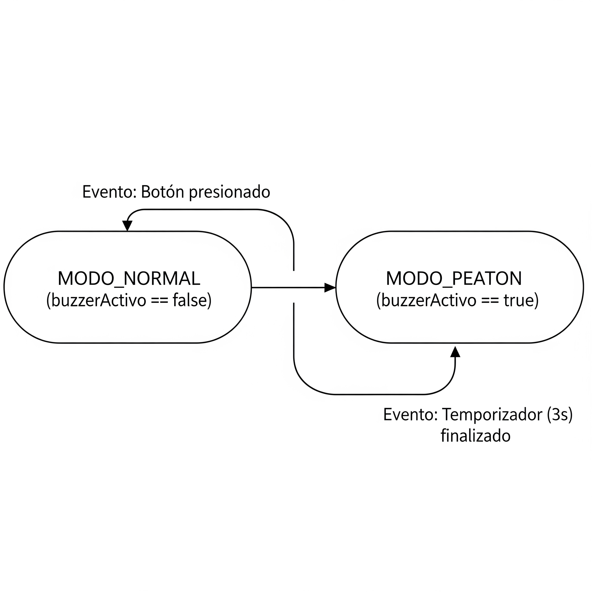

1. # Semáforo para personas no videntes con alerta sonora

El sistema consiste en un semáforo automatizado que utiliza luces LED y señales sonoras para asistir a personas con discapacidad visual al cruzar la calle. Incluye un botón de petición de paso y un zumbador que emite sonido según el estado del semáforo.

2. ## Intregantes:
   
Lucas Viña 
lvinsci2006@gmail.com

Julian Rivadeo
julianrivadeo.tecnicatura@gmail.com

Maximiliano Candia
maximiliano.candia12@gmail.com

Juan Ignacio Cucarella
qkjuani29@gmail.com

3. ## Docentes y materia

Docentes: Pedro Iriso, Matias Gagliardo

Materia: Laboratorio de computacion 1  

4. ## Descripcion y funcionalidades.

   
Para este proyecto se simulará un paso peatonal para ciegos, adaptado a una avenida con 3 cruces peatonales, y una alarma sonora que se emitirá a petición del peaton cuando decida cruzar la calle, de esta manera la persona no vidente usará debidamente el paso mediante el sentido de la audicion.

Los semaforos seran realistas y continuos.
Los botones de cada cruce colocarán el semaforo a rojo durante determinado tiempo.

5. ## Requisitos funcionales cumplidos:

    Aquí listas los 4 requisitos que ya vimos:

    Control de Entradas/Salidas: El sistema lee 3 entradas (digitalRead de los botones) y controla 10 salidas (9 analogWrite para los LED RGB y 1 tone para el buzzer).

    Contador de Flancos: Se implementa con la variable conteoBuzzer. Solo se incrementa al detectar el flanco de activación del botón (if (... && !buzzerActivo)).

    Control Lógico por Tiempo: El sistema usa millis() para dos temporizadores independientes: la onda verde (ahora - tiempoInicio) y el cruce peatonal (ahora - buzzerInicio).

    Máquina de Estados: El sistema tiene 2 estados principales controlados por la variable buzzerActivo (MODO_NORMAL y MODO_PEATON).

6. ## Componentes utilizados
   1 Arduino UNO,
   1 Protoboard,
   3 Led's RGB,
   3 Pulsadores,
   1 Buzzer,
   13 Resistencias,
   22 Cables macho-macho.

7. ## Diagrama de conexiones
   

   
8. ## Explicacion maquina de estados.

  
Estado MODO_NORMAL (buzzerActivo == false)

    Accion de Estado: ejecutarOndaVerde() mientras forzado de actualizarSemaforo sea false.

Transición (NORMAL a PEATON)

    Cuando se pulsa el boton presionado && !buzzerActivo 

    Acciones: Cuando esto ocurre, el programa ejecuta varias acciones a la vez para pasar al otro estado:

        buzzerActivo = true

        buzzerInicio = ahora

        rojoForzadoX = true

        tone(BUZZER_LED, 500)

Estado MODO_PEATON (buzzerActivo == true)

    Acción de Estado: forzarRojo() mientras forzado de actualizarSemaforo sea true.

    El programa fuerza el rojo correspondiente.

Transición (PEATON → NORMAL)

    Cuando buzzerActivo && (ahora - buzzerInicio >= 3000) comprueba si realizar la onda verde a cada semaforo.

    Acciones: Cuando el tiempo se cumple, el programa ejecuta estas acciones para volver al inicio:

        buzzerActivo = false

        rojoForzado1/2/3 = false

        noTone(BUZZER_LED)

9.  ## Instrucciones de uso y ejecucion.

  1-  Ubique el botón al lado del poste del semáforo, encontrará un pulsador para peatones.

  2-  Solicite el cruce pulsando el boton.

  3-  Espere la señal auditiva Inmediatamente después de presionar el botón, el sistema activará una alarma sonora (un pitido constante).

  4-  Cruce con precaución.

   IMPORTANTE: 
    El inicio del sonido es su señal para comenzar a cruzar. En este momento, el semáforo para los vehículos de ese cruce se ha puesto en rojo.
    El sonido durará 3 segundos. Este es el tiempo total del que dispone para cruzar la calle.
    Cuando el sonido se detenga, el tiempo de cruce ha finalizado y el semáforo volverá a su ciclo normal. No intente cruzar si el sonido ya se detuvo.

10. ## Video de funcionamiento

  [Mirá el video de demostración del proyecto](https://youtube.com/shorts/sHnKPJpQ0Dg?feature=share)

12. El semaforo estará en continuo funcionamiento, debe accionar el boton para iniciar la peticion del cruce peatonal durante 5 segundos.

13. //-------------------------------------------------------------------------------------------------//

14. //-------------------------------------------------------------------------------------------------//
   

